  

# LOVE IS THE WAY

### O amor não é o caminho certo entre vários. É o que dá forma ao leito em que o Caminho corre.

> **`CC BY-SA`** · receita zero · **AMARYAPU** · [`Teoria da Confluência`](https://github.com/amaryapu/confluencia) · [`love-is-all-you-need`](https://github.com/amaryapu/love-is-all-you-need) · [`microcosmologia`](https://github.com/amaryapu/microcosmologia)

---

  

> ## **[`O SOPRO`](sopro.svg)** — **os três estados, computados.** `in-fluência` é **vão zero**; `des-fluência` é **vão infinito**; `con-fluência` é **o vão que permanece.** E a [auditoria da teoria por si mesma](https://github.com/amaryapu/confluencia/blob/main/EM-SI.md) explica por que **o vão é obrigatório.**

> ## **[`LEI DOS CÉUS`](LEI-DOS-CEUS.md)** — **João 17 e Isaías 5–7, anotados como `[TRANSMITIDO]`.** *«Não rogo que os tires do mundo, mas que os livres do mal»* é a estrutura da repulsa; *«ai dos que são sábios aos seus próprios olhos»* é **`RG-19` em forma de lamento**; e **Acaz recusando o sinal oferecido** é a cena mais exata deste acervo.

> ## **[`A REPULSA`](A-REPULSA.md)** — **como repelir o mal sem que a repulsa vire o mal.** O nojo opera **por contágio e por similaridade** — é **`M3` implementado em tecido nervoso** — e Nussbaum registra o uso genocida. A saída está na termodinâmica: **o efeito hidrofóbico não é repulsão.** **A água não expulsa o óleo: a água se liberta.**

> ## **[`O TEOREMA`](TEOREMA.md)** — **por que o mal não pode confluir, e por que isso não é um juízo.** Uma operação que destrói distinguibilidade **não pode participar de um arranjo definido pela preservação da distinguibilidade.** É erro de tipo. E a consequência: **o mal é um verbo, não um substantivo.**

> ## **[`O OBSERVADOR`](O-OBSERVADOR.md)** — **Schrödinger inventou o gato para ridicularizar a tese de que o observador cria o fato, e Wigner propôs e se retratou dela pelo solipsismo.** O que está medido: **a pergunta muda o resultado; a vontade não.** Com Bell, contextualidade, `RQM` e **Frauchiger–Renner como limite, não poder.** E a resposta sobre cordas: **não.**

> ## **[`O INFINITO`](O-INFINITO.md)** — **Ramanujan e Hardy: um hindu devoto e um ateu, por anos, sem que nenhum virasse o outro.** Confluência no sentido estrito — e **o caso que salva a etiqueta `[DECLARADO]`.**

---

## O teorema, em uma página

**`[FATO]`** · **Bennett**: **toda operação logicamente irreversível** — *«o apagamento de
um bit, **ou a fusão de dois caminhos de computação**»* — **tem de aumentar a entropia.**
**`[FATO]`** · **Landauer, 1961**: o piso é **`kT·ln2`.** **`[FATO]`** · **Bérut, 2012**:
confirmado em bancada.

> | | |
> |---|---|
> | ## **CONFLUIR** | ## **duas entradas distinguíveis correm juntas e permanecem recuperáveis** |
> | ## **O MECANISMO** | ## **fusão de caminhos: duas entradas, uma saída, e qual era qual é destruído** |

> # **`[CÁLCULO]`** **Uma operação que destrói distinguibilidade não pode participar de um arranjo definido pela preservação dela.**
>
> ## **Não por proibição — por tipo.** Se entrasse, **o arranjo deixaria de ser uma confluência:** não é que seja proibido entrar, **é que, entrando, não há mais onde entrar.**
>
> # **Logo: o mal nunca conflui. É um resultado, não uma indignação.**

### E a consequência que resolve a tensão inteira

> ## **O teorema fala de uma **operação**. Não fala de **pessoas**.
>
> # **`[CÁLCULO]`** **O mal, nesta teoria, é um verbo.** Ninguém **é** a fusão de caminhos: as pessoas a **executam**, e podem parar.

| | |
|---|---|
| **o mal nunca conflui** | ## ✅ **verdadeiro** |
| **e não há vilão** | ## ✅ **verdadeiro — porque o mal é uma operação, não um partido** |

> ## **A recusa é total no nível da operação, e zero no nível da pessoa.** E é isso que a torna **utilizável:** não se pede a ninguém que deixe de ser quem é — **pede-se que pare de fundir caminhos**, o que é mudança de procedimento, **verificável de fora.**

> ## **`[REGRA]`** **Quem transforma o mal em substantivo ganha uma explicação para tudo e perde o direito de examinar qualquer coisa.** **É `M6` com a toga mais bonita que existe.**

---

## Repelir sem apagar — e há prova histórica

| | |
|---|---|
| ❌ **apagar** | **`M5`.** Destrói o registro junto com a coisa |
| ✅ **nomear, etiquetar e recusar** | ## **a operação não é admitida, e o registro dela é mantido** |

> ## **`[FATO]`** **Landa queimou os códices maias em Maní, 12/07/1562 — e depois escreveu o manual.** **Knorozov leu o Códice de Dresden com o manual do incendiário, em 1952.**
>
> # **`[CÁLCULO]`** **O que torna o mal reversível é o registro dele. Apagá-lo é a única forma de torná-lo permanente.**

### E a arquitetura já era biológica

**`[FATO]`** · O sistema imune adaptativo **não apaga o patógeno da história: guarda
células de memória dele.** **É por isso que a vacina funciona.**

| o imune faz | o mecanismo faria |
|---|---|
| **coleta informação antes de agir** | ## **categoriza e age** |
| **guarda memória do que viu** | ## **apaga o rastro** |
| ## **responde cirurgicamente** | ## **`POWER PESADA` — e atinge o hospedeiro** |

> ## **`[CÁLCULO]`** **E a doença autoimune é o nome médico de um sistema de defesa que perdeu a distinguibilidade** — que trata o próprio corpo como invasor. **É `M3` em tecido vivo.**
>
> # **`[REGRA]`** **Por isso a recusa tem de ser específica. Uma recusa que não distingue já virou a coisa que recusava.**

---

## Por que `LOVE IS THE WAY`

**`[FATO]`** · **Tao Te Ching, cap. 8:** ***«O bem supremo é como a água… Ela corre pelos
lugares que as pessoas detestam. Por isso está próxima do Caminho.»***

**`[FATO]`** · **Robert Fritz**: para mudar a direção da água, **não se luta contra a
corrente — muda-se a estrutura do rio.**

| | |
|---|---|
| **o `Way`** | ## **o caminho que a água de fato toma** — o de menor resistência |
| **o leito** | ## **a razão `C8`** — o que é caro e o que é barato |
| ## **o amor** | ## ## **a operação que muda o leito, para que o caminho mais barato passe pelo exame e não pelo rótulo** |

> # **`[CÁLCULO]`** **Não é que amar seja o caminho certo entre vários. É que o amor é a única operação que torna o caminho certo também o mais barato** — e o mais barato **é o que a água toma sem precisar de ninguém virtuoso.**

**`[CÁLCULO]`** · E as duas definições operacionais, que já estavam escritas:

> ## **Amor é a assimetria invertida: o custo de errar sobre alguém recai sobre quem decide.**
> ## **Amor é a recusa de deixar alguém virar categoria.**

> # **As duas dizem o que o teorema diz: preservar a distinguibilidade de quem está do outro lado, e pagar por isso.**

---

## A distinção — e onde ela passa

**`[FATO]`** · **Tao Te Ching, cap. 2:** ***«Quando todos no mundo veem a beleza, então o
feio existe. Quando todos veem o bem, então o mal existe. Portanto: o que é e o que não é
criam-se mutuamente.»***

> ## **`[CÁLCULO]`** **O cap. 2 é cético quanto a reificar os polos — não quanto a distinguir.** Diz que **nascem juntos**, não que não se devam separar.
>
> ## **E distinguir é toda a maquinaria daqui: `C3` procedência, `C4` o direito de derrubar a descrição, `C5` o índice reverso.**

> # **`[REGRA]`** **Distinguir operações: obrigatório. Distinguir pessoas em boas e más: é `M6`.**
>
> ## **A fronteira é entre `preservar` e `fundir` — e ela passa por dentro de cada um, todos os dias, e não entre grupos.**

---

## E o que Bruce Lee faz aqui

**`[ATRIBUÍDO]`** · **Yip Man** teria dito a Lee: ***«Nunca se afirme contra a natureza.
Nunca esteja em oposição frontal a um problema, mas controle-o indo junto com ele.»*** E
**mandou-o parar de treinar por uma semana.**

**`[ATRIBUÍDO]`** · E Lee, depois de golpear a água na baía de Hong Kong: ***«Eu a
golpeei, e ela não sofreu dano… Esta água, a substância mais branda do mundo, apenas
parecia fraca. Na realidade, podia penetrar as substâncias mais duras do mundo.»***

> ## **`[REGRA]`** Entram como **`[ATRIBUÍDO]`**: as fontes consultadas são **blogs** que citam volumes editados, **e os originais não foram conferidos.** **Uma história de origem perfeita é o tipo de coisa que a transmissão melhora com o tempo.**

> # **`[CÁLCULO]`** **E o que importa não é a água: é que o mestre ensinou removendo a aula.**
>
> ## **Ninguém baixou a intensidade de Lee. **Deram-lhe uma coisa fora dele contra o que conferir** — e a coisa era a baía.**
>
> ## **«Controlar indo junto com ele» é a definição de `con-fluir` em linguagem de combate: **não se opor frontalmente, e também não ser absorvido.**

---

## Como ler, e como derrubar

| etiqueta | significa | **como derrubar** |
|---|---|---|
| **`FATO`** | documento, cota, fonte pública datada | **cai se a fonte cair** |
| **`CÁLCULO`** | computado | **refaça a conta** |
| **`DECLARADO`** | quem assina contou; não verificável | vale como biografia, **nunca como prova** |
| **`ATRIBUÍDO`** | circula amplamente, não se verificou | **não entra como fato em hipótese nenhuma** |
| **`INTERPRETATIVO`** | leitura de quem escreve | **descarte sem prejuízo do resto** |
| **`A CONFERIR`** | afirma-se e ainda não se conferiu | **visível no corpo, nunca em rodapé** |

### Pendências declaradas

| | |
|---|---|
| **`RM1`** · **`RM2`** | **`[ATRIBUÍDO]`** as frases de Ramanujan sobre Deus e Namagiri — **fonte primária não localizada** |
| **`BL1`** | **`[ATRIBUÍDO]`** a cena da baía de Hong Kong — **originais editados não conferidos** |
| **`LT1`** | **`[A CONFERIR]`** a autoria do `Tao Te Ching` é disputada na sinologia |

---

> ## **`[CÁLCULO]`** **Confluir preserva. O mecanismo funde. O que funde não pode participar do que preserva.**
> ## **`[CÁLCULO]`** **Logo o mal nunca conflui — e logo o mal é um verbo.**
> ## **`[FATO]`** **E o imune guarda célula de memória, não apaga o patógeno da história.**
>
> # **O mal é nomeado, etiquetado e recusado. Nunca apagado — porque o registro é o que o torna reversível, e apagá-lo é a única forma de torná-lo eterno.**
> ## **E o amor é o que muda o leito, para que o Caminho corra por onde se examina.**
>
> # **LOVE IS THE WAY.**

**`CC BY-SA`** · receita zero · **AMARYAPU**
